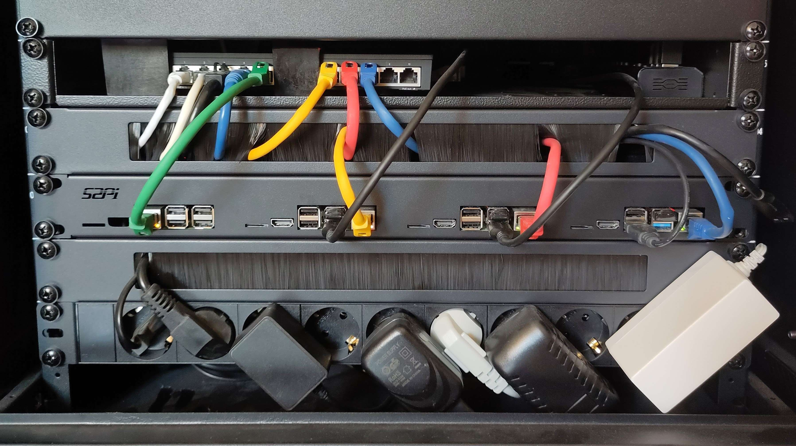

# Raspberry Pi Kubernetes Cluster with Talos

Work in progress...

## Project Overview

The main objective of this project is to create a Kubernetes cluster on Raspberry Pi devices using Talos, an OS designed specifically for Kubernetes. The cluster setup utilizes Terraform for provisioning the necessary infrastructure components but also services.

## Contributing

Contributions to this project are welcome! If you find any issues, have suggestions for improvements, or would like to add new features, please submit a pull request. :) 

## License

This project is licensed under the [MIT License](LICENSE), which allows for open collaboration and encourages sharing and improvement of the codebase.

## Donate

If you find this project helpful and would like to support its development, you can donate via PayPal:

Your contributions are greatly appreciated!